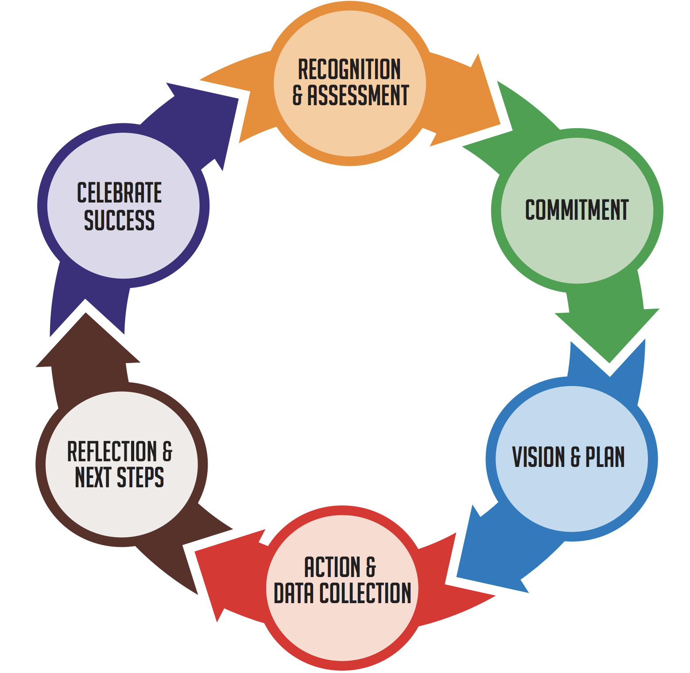
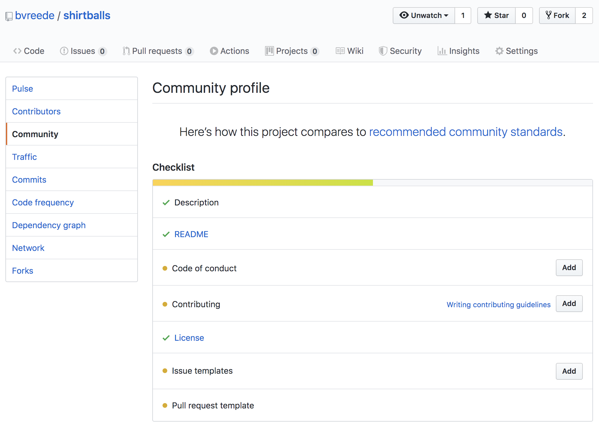
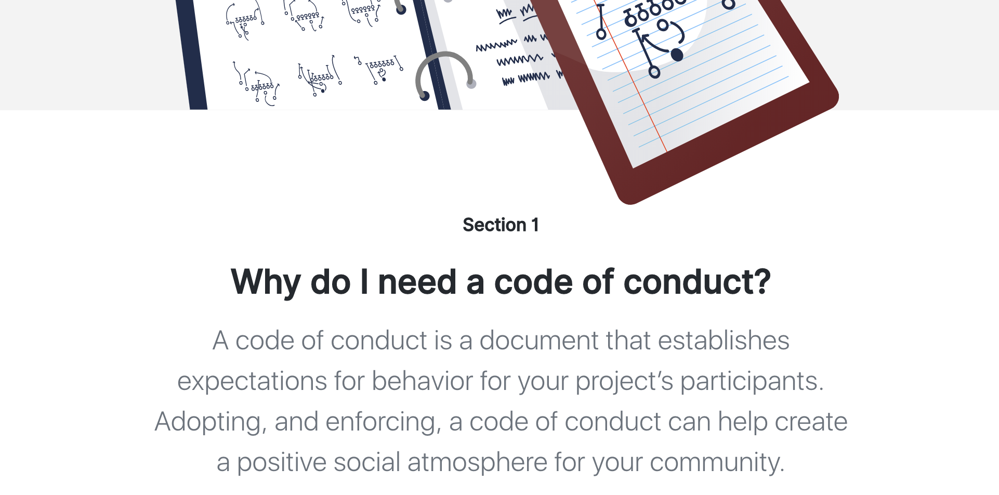
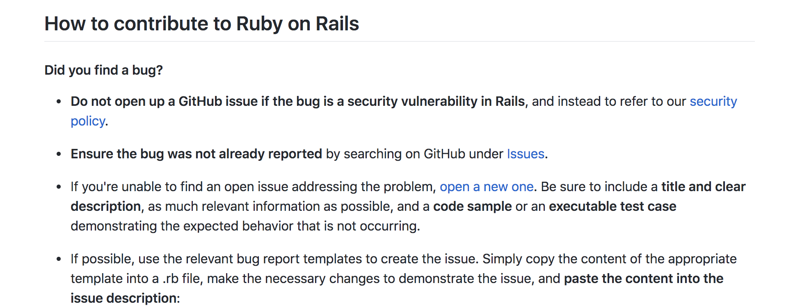
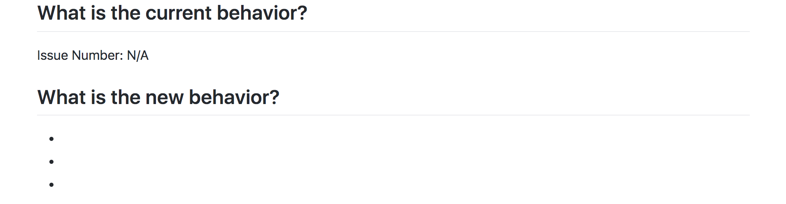

```{r setup, include=FALSE}
options(htmltools.dir.version = FALSE)
```

# Open science & inclusivity

> **Open is cancelled.** (...) Copyright and software licences have failed to control bad actors and to support marginalised creators. The underlying theory is flawed and shallow. It’s time to move on and create a new wave of ethics focused community management tools for code and content. (...) Because the reality is that unless justice is centred, unless systems, technological and social, are built with the needs of oppressed groups at the forefront — anything we build will only serve to reinforce existing inequities.

From: [A bee with a blog
](https://medium.com/@beewithablog/open-is-cancelled-da7dd6f2aaaf)


---
# Welcoming and inclusive communities



.footnote[Source: [Welcoming and Inclusive Communities Toolkit](http://mcos.ca/wp-content/uploads/2017/07/module-1_toolkit_what-is-a-welcoming_and_inclusive_community.pdf)]

---
# Including others

What are we doing for whom? (A very, very rough guide.)

| User | Community
--------:|:---------:|:---------:|:-------:
Installation instructions | `r emo::ji("white_check_mark")` | `r emo::ji("white_check_mark")`
Dependency information | `r emo::ji("white_check_mark")` | `r emo::ji("white_check_mark")` 
Citation information | `r emo::ji("white_check_mark")` | 
Vignette/notebook | `r emo::ji("white_check_mark")` |
Code documentation | | `r emo::ji("white_check_mark")`
Issue template | `r emo::ji("white_check_mark")` | `r emo::ji("white_check_mark")`
Pull request template | | `r emo::ji("white_check_mark")`
Contribution guidelines | | `r emo::ji("white_check_mark")`
Community Code of Conduct | `r emo::ji("white_check_mark")` | `r emo::ji("white_check_mark")`

---
# Repository > Insights > Community


---
# Community code on Github

- Community checklist:
  - Description
  - README
  - License
  - [Code of Conduct](https://opensource.guide/code-of-conduct/)


---
# Code of Conduct

>"Facilitate healthy and constructive community behavior by adopting and enforcing a code of conduct."
[opensource.guide](https://opensource.guide/code-of-conduct/)

#### Why do I need a code of conduct?
A CoC establishes expectations for behavior for your participants, and can help create healthy, constructive community behavior. 
--

#### Establishing a code of conduct
Establish a CoC as early as possible. Describe _where_ the code of conduct takes effect, _whom_ it applies to, _what_ happens if someone violates it, and _how_ someone can report violations.
--

#### Commit to enforcing your code of conduct
Take reports seriously and investigate. Doing so signals to your community that you value their perspective and trust their judgment. Finally, take appropriate action.
--

#### Encourage the behavior you want to see
When a project seems hostile or unwelcoming, you may lose (potential) contributors. Fostering a welcoming environment will help your community grow!
---
# Creating a code of conduct

- Use a template, e.g. the [Citizen Code of Conduct](http://citizencodeofconduct.org/), or the [Contributor Covenant](https://www.contributor-covenant.org/)

- Find a CoC you believe in, e.g. the [Django Code of Conduct](https://www.djangoproject.com/conduct/)

- Write a code of conduct with your community.
  - Ensure inclusiveness before starting (e.g. works well in a workshop/sprint environment)
  - Have trustworthy and impartial backup to deal with enforcement

--
 
#### Adding your code of conduct to your repository:
Add a `CODE_OF_CONDUCT.md` file to the root of your repository.

---

# Community code on Github

- Community checklist:
  - Description
  - README
  - License
  - Code of Conduct
  - [Contributing guidelines](https://help.github.com/en/github/building-a-strong-community/setting-guidelines-for-repository-contributors)
  

---
# Contributing guidelines

Answer questions like: what do you want people to do when they find bugs? When they have written a contribution to the code? Or if they have documentation to add?

--

For example: [Ruby on Rails](https://github.com/rails/rails/blob/master/CONTRIBUTING.md)



--
#### Adding your code of conduct to your repository:

Add a `CONTRIBUTING.md` file to the root of your repository.

---
# Community code on Github

- Community checklist:
  - Description
  - README
  - License
  - Code of Conduct
  - Contributing guidelines
  - [Issue template]()
  - Pull request template

[Ionic pull request template example](https://github.com/ionic-team/ionic/blob/master/.github/PULL_REQUEST_TEMPLATE.md)

---
# Creating an issue template

- Look at issues on similar projects. What do you want to know from your users?

- Basic questions you expect:
  - Feature request ("Can you add this cool functionality?")
  - Bug report ("It does not work...")
  - ... something specific for your project?

- Github guides you through this quite well!

--

#### Adding your issue templates: 
Create an `ISSUE_TEMPLATE.md` file, preferably in a `.github` directory. For specific template options, create an `.github/ISSUE_TEMPLATE/` directory, and populate it with your issue templates. E.g:
- `/.github/ISSUE_TEMPLATE/feature_request.md`
- `/.github/ISSUE_TEMPLATE/bug_report.md`

---

# Creating a pull request template



Source: [Ionic pull request template](https://github.com/ionic-team/ionic/blob/master/.github/PULL_REQUEST_TEMPLATE.md)


#### Adding your pull template(s): 
Create a `PULL_REQUEST_TEMPLATE.md` file, preferably in a `.github` directory. For specific template options, create an `.github/PULL_REQUEST_TEMPLATE/` directory, and populate it with your templates. E.g:
- `/.github/PULL_REQUEST_TEMPLATE/documentation_contribution.md`
- `/.github/PULL_REQUEST_TEMPLATE/patch.md`
