```{r setup, include=FALSE}
options(htmltools.dir.version = FALSE)
```
# What is science?

.quote[Science is a systematic enterprise that builds and organizes knowledge in the form of testable explanations and predictions about the universe.]
.source[[Wikipedia](https://en.wikipedia.org/wiki/Science)]

---
# What is science?

.quote[If I have seen further, it is by standing on the shoulders of Giants.]
.source[[Sir Isaac Newton](https://en.wikipedia.org/wiki/Standing_on_the_shoulders_of_giants)]


---
# Merton's Scientific Norms

- **Communalism**: scientific results are the common property of the community. 

- **Universalism**: all scientists can contribute to science regardless of race, nationality, culture, or gender.

- **Disinterestedness**: act for the benefit of a common scientific enterprise, rather than for personal gain.

- **Skepticism**: scientific claims must be exposed to critical scrutiny before being accepted.

_Robert K. Merton, 1942_

--

#### Do you feel we are upholding these norms?

---
# The Reproducibility crisis


.footnote[Source: [1,500 scientists lift the lid on reproducibility](https://www.nature.com/news/1-500-scientists-lift-the-lid-on-reproducibility-1.19970), Nature (2016)]
---
# Replication vs. reproduction

- **computationally reproducible** means: with same code + same data + same environment
== same results

- Not the same as **replication**, where _different_ methods and _different_ data lead to the same research findings


.footnote[Source: [Towards Data Science](https://towardsdatascience.com/data-sciences-reproducibility-crisis-b87792d88513)]

---
# Reproducibility issues == research waste

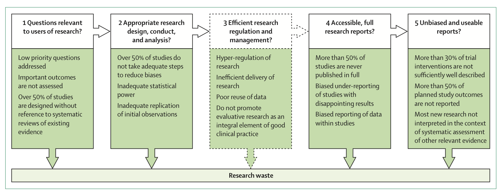
There are many reasons for problems in reproducibility. Each requires its own approach. All lead to a loss of time, effort, resources, credence: **research waste**.


.footnote[Source: Sean Grant, [Transparency and the Research Cycle](https://osf.io/mk7y5/)]
---
# Tackling research waste

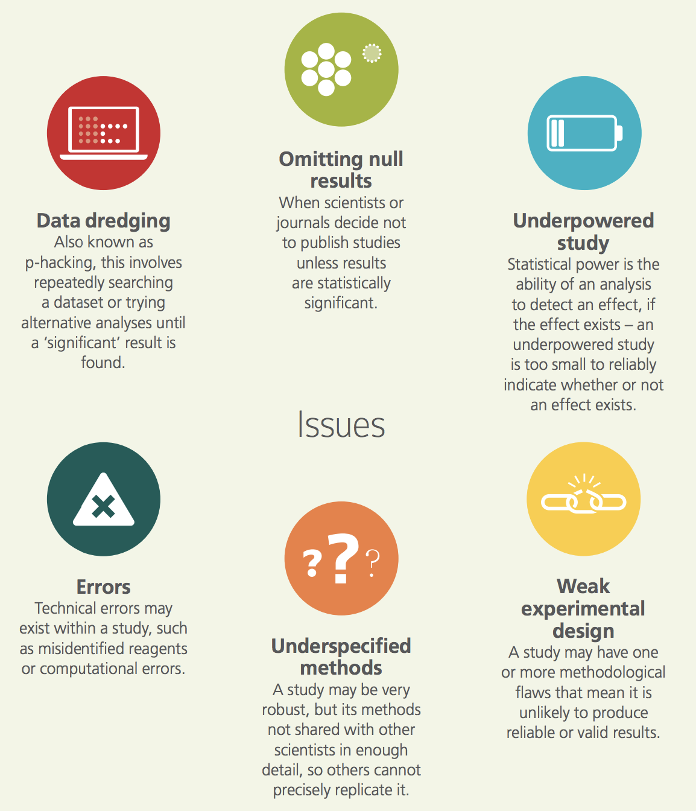
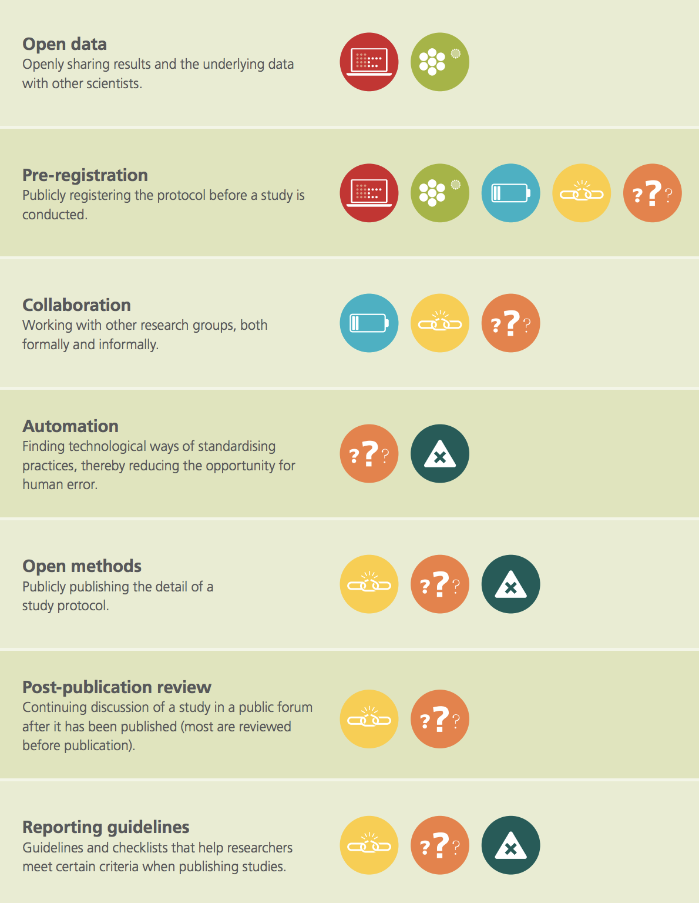


.footnote[Source: [UK Academy of Medical Sciences](https://acmedsci.ac.uk/file-download/38208-5631f0052511d.pdf)]
---
# Why is this happening?

#### Perverse incentives embedded in the system

- Little funding, lots of people: a highly competitive system
- Publication pressure: "Publish or Perish"
- Selective reporting: positive over negative outcomes, and novelty over replication.

--

#### Researchers are, ahem, human!

- Humans are biased to see patterns, even where none exist
- Subject to confirmation bias for pet theories/convictions
- Not immune to outside pressure
- Limited time, limited resources
- Researchers are trained specialists, yet expected to be all-round excellent (spoiler alert: this is pretty hard)._

--

#### In short: Science is a human endeavour. 
Humans make choices, have biases, experience system pressure.

---
# Mistakes were made

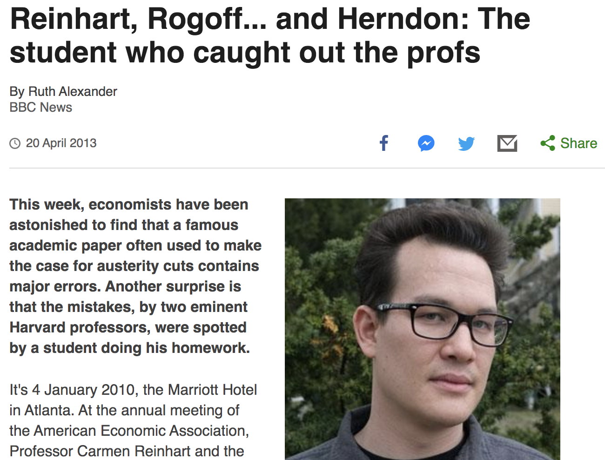


.footnote[Source: [Ruth Alexander, BBC News](https://www.bbc.com/news/magazine-22223190)]

---
# Mistakes were made


Spot the difference:


.pull-left[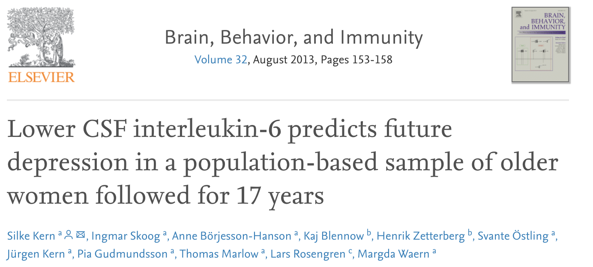
Published 08/2013,
retracted 02/2014]
.pull-right[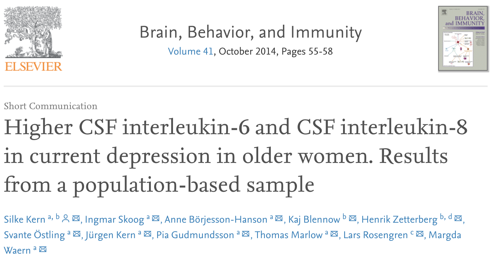
Published 10/2014]


.footnote[Source: [Bad spreadsheet merge kills depression paper, quick fix resurrects it](https://retractionwatch.com/2014/07/01/bad-spreadsheet-merge-kills-depression-paper-quick-fix-resurrects-it/)]


---
# Mistakes were made

My own experience...


---

# Researcher degrees of freedom

Opportunistic use of researcher degrees of freedom when:
- Formulating hypotheses
- Designing the study
- Running the study
- Analyzing the data
- Reporting the study

.footnote[See: Marjan Bakker, [Scientific Conduct and Researcher Degrees of Freedom](https://osf.io/nrsvu/)]
---
# Opportunistic use of researcher DF

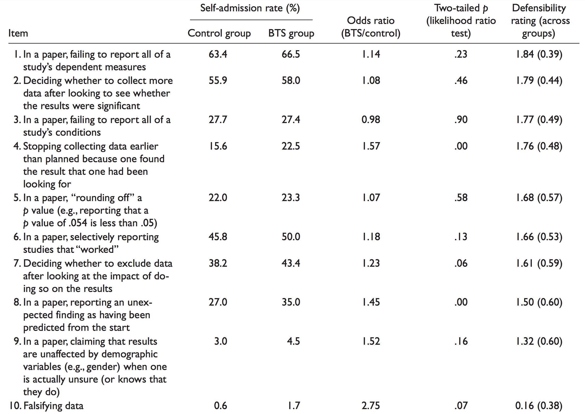
.footnote[Source: [John _et al._, 2012; Psychological Science](https://journals.sagepub.com/doi/abs/10.1177/0956797611430953)]

---
# Self-cleaning nature of science

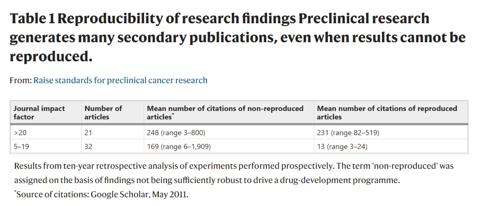

"Some non-reproducible preclinical papers had spawned an entire field, with hundreds of secondary publications that expanded on elements of the original observation, but did not actually seek to confirm or falsify its fundamental basis."

.footnote[Source: [Begley & Ellis, 2012](https://www.nature.com/articles/483531a?cmpid=microsoft)]
---

# The value of reproduction

Reproduction is a vital contribution to science: by preventing (further) research waste, and identifying the giants on whom to stand. Yet we keep them to ourselves.

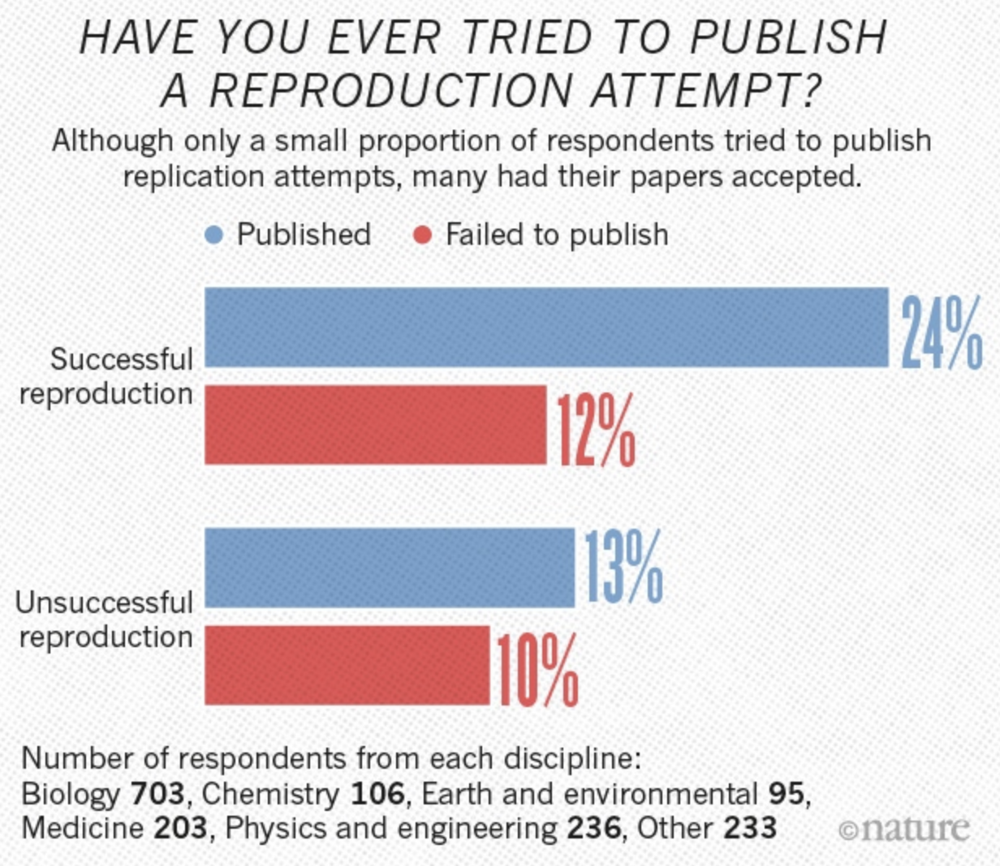

.footnote[Source: [1,500 scientists lift the lid on reproducibility](https://www.nature.com/news/1-500-scientists-lift-the-lid-on-reproducibility-1.19970), Nature (2016)]

---
# The value of reproduction

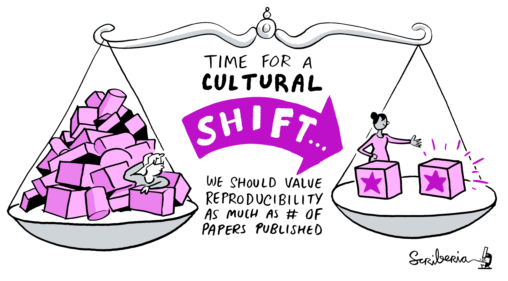

.footnote[Image by Scriberia, CC-BY]
---
# Replicated Science as a publication

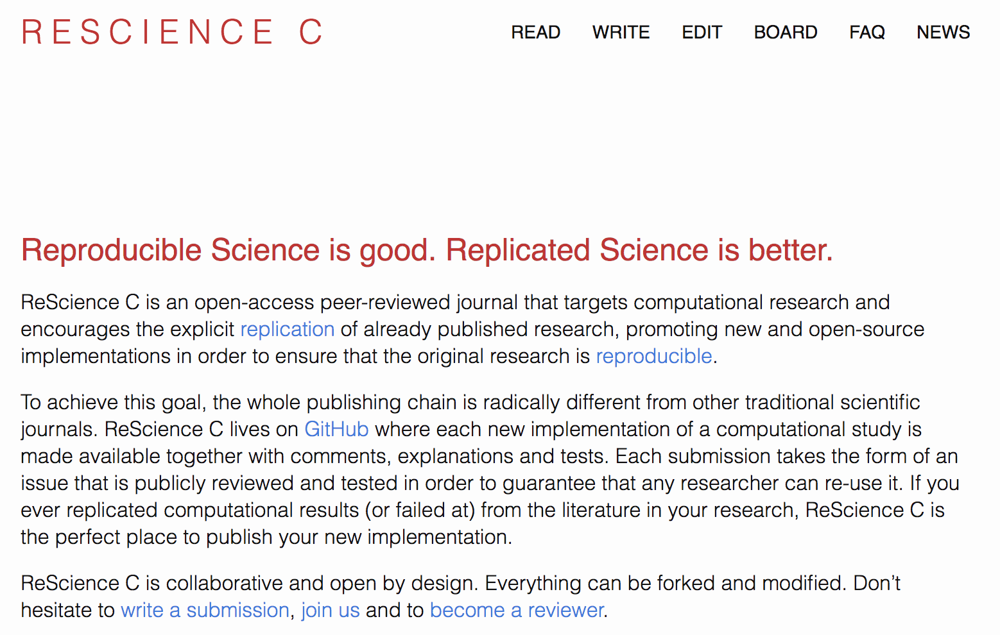

.footnote[[rescience.github.io](https://rescience.github.io/)]
---
# The Four Facets of Reproducibility

.pull-left-medium[
#### Documentation
What do you need to execute this project? Where do you start?

#### Organization
Demonstrate a trustworthy workflow.

#### Automation
Automated analyses trace your steps, and prevent human error (or at the very least: document it).

#### Dissemination
Share your data, release your code, publish your findings.]

--
.pull-right-medium[

]
---
# The ultimate goal

.quote[To advance the integrity, credibility, and utility of research.]

.source[Sean Grant]

.footnote[Source: Sean Grant, [Transparency and the Research Cycle](https://osf.io/mk7y5/)]
